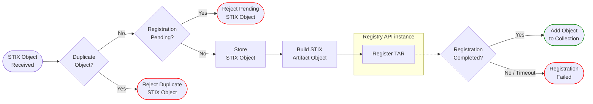

# Architecture

This document describes how the BCBCTI server functions.

## Overview

The BCBCTI server is built around Compellio Gateway's [Registry API](https://docs.compellio.com/registry/) to register STIX Objects as Tokenized Asset Records (TARs).

```mermaid
%%TODO
```

[//]: # (TODO quick summary of TARs ~= TARs are verifiable tokens and have json payloads)

## Data Flow

When new STIX objects are submitted, the server decides whether to create a new TAR for the object, update the existing TAR associated with the object, or reject it.

This is a high-level overview of how an object is processed:



Submitted objects will only appear in their collection once they have been properly registered by the Registry API.

A limitation of the current BCBCTI version is that STIX Object modifications will be rejected (_Reject Pending STIX Object_) until the previously submitted version gets registered by the Registry API.

A rejected or failed submission can be resubmitted by the client, but BCBCTI does not retry on the client's behalf.
